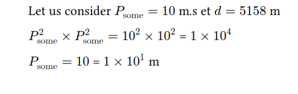

# typst eval_compute package
**typst package allowing you to display equation and their computation at the same time.**

Example usage : 
```
Let us consider 
#let a = node("P_\"some\"",10);#show_node(a) m.s 
et
#let b = node("d",5158);#show_node(b) m

#expr(
  digits : 0,
  ":a^2 * :a^2",      
)

#expr(":a") m


#expr(
  "(:a + :b)/ (:b)  - 5"
)


#expr(
  "(:a * :b)/ (:b)  - 5",      
)
```
would compile to:

